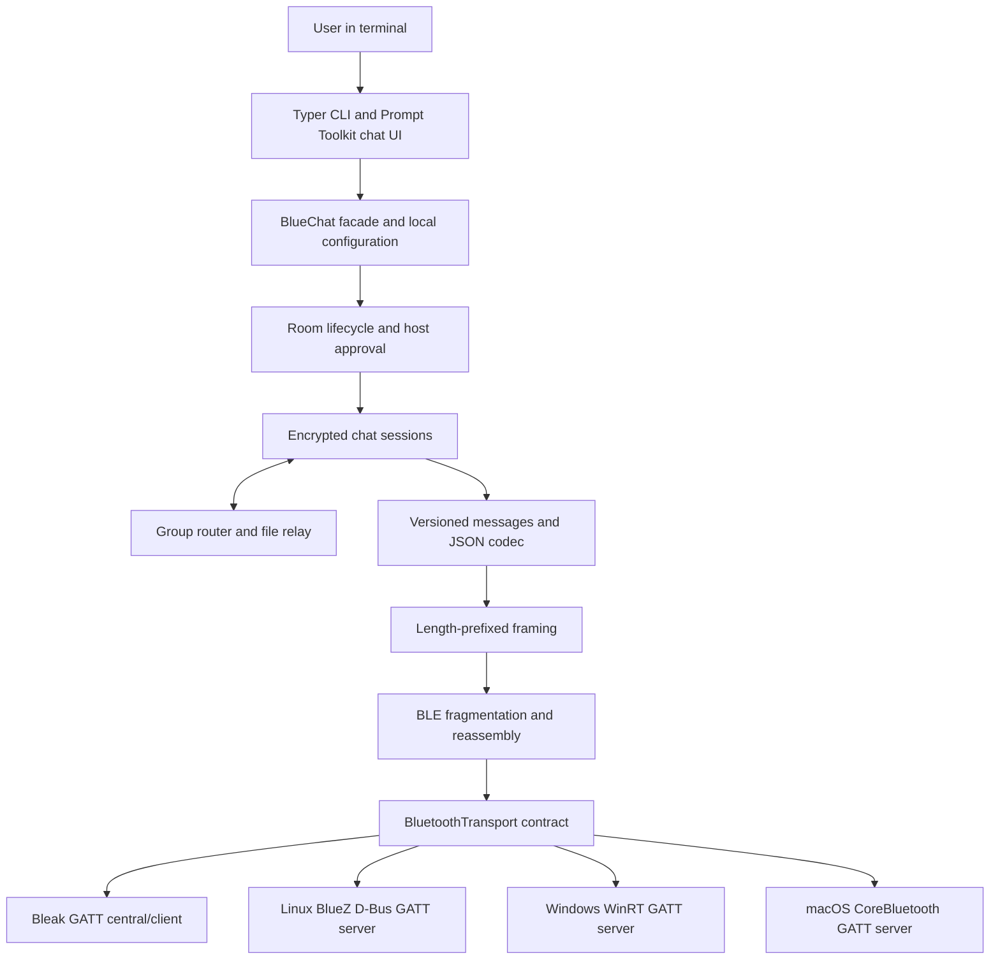
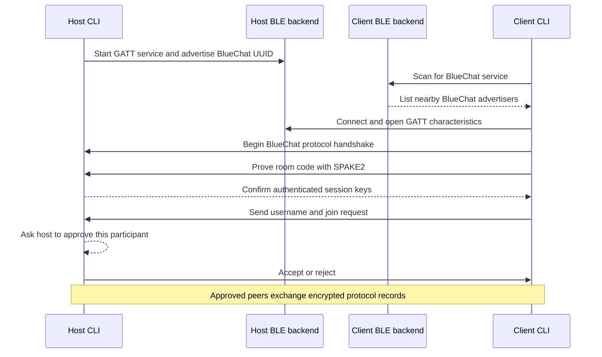

# BlueChat Architecture

This document explains how the current BlueChat implementation fits together.
It is a guide for contributors and curious users; the terminal commands remain
the supported way to use the application.

## At a glance

BlueChat separates the terminal UI, room/session behavior, wire protocol,
security, and Bluetooth implementation. The CLI and importable `BlueChat`
facade use the same services. OS-specific Bluetooth APIs stay inside platform
backends.

For a hosted room, the host is a BLE peripheral/GATT server; each joining
computer is a BLE central/client. Group rooms use a star topology: each client
connects to the host, which routes messages and accepted file transfers. BlueChat
does not create a Bluetooth mesh.

## Component map

| Area | Responsibility |
|---|---|
| `cli.py`, `ui/` | Menus, prompts, chat input/output, command dispatch, and friendly errors. UI code calls shared services rather than owning transport or room rules. |
| `app.py` | Public `BlueChat` facade. Loads the local profile, exposes settings, creates rooms, and accepts an injected Bluetooth manager. |
| `config/` | Validates and persists TOML configuration in the platform-appropriate directory from `platformdirs`. |
| `bluetooth/base.py` | Platform-neutral device, connection, pairing, capability, and async transport contracts. |
| `bluetooth/manager.py` | Selects the backend for the current OS and checks adapter state and requested capabilities. |
| `bluetooth/bleak_central.py` | Shared BLE scanning and central/client operations through Bleak. |
| `bluetooth/linux.py` | BlueZ adapter access, GATT server registration, advertising, peer acceptance, and notifications through D-Bus. |
| `bluetooth/windows*.py` | Windows GATT service hosting through WinRT, with native callbacks bridged to asyncio. |
| `bluetooth/macos*.py` | CoreBluetooth peripheral hosting through PyObjC, with delegate callbacks bridged to asyncio. |
| `bluetooth/gatt.py` | Shared service/characteristic UUIDs and bounded BLE fragment encoding/reassembly. |
| `chat/` | Room codes, participant IDs and approval, encrypted sessions, host routing, and duplicate suppression. |
| `protocol/` | Versioned control/chat messages, strict validation, JSON encoding, and stream framing. |
| `security/` | SPAKE2 room authentication, transcript confirmation, key derivation, authenticated encryption, and short-lived resume credentials. |
| `transfer/` | File offers, recipient approval, chunk streaming, safe destinations, and SHA-256 verification. |
| `history/` | Optional local JSONL conversation history, controlled by each participant. |

## Host and join lifecycle

The host generates a six-character room code using `secrets`. The code uses an
ambiguity-reduced alphabet, expires after five minutes, and is validated by the
host. Expiration prevents new joins but does not close existing sessions. The
host rate-limits failed attempts. OS Bluetooth pairing, when needed, is separate
from BlueChat room authentication.

The CLI runs asynchronous room services so receiving messages and transfer
events does not depend on the user stopping their input. The terminal UI and
commands are clients of those services, not separate implementations of them.

## BLE transport and protocol layers

BlueChat uses BLE GATT because desktop OSes do not expose one uniform RFCOMM
server API. Its custom service UUID is
`a64e2f20-8d8a-4f1b-a5cc-5d64b5c0a100`. The RX characteristic accepts client
writes; TX sends host indications. These characteristics are byte channels,
not separate chat-command APIs: control, text, and transfer records all use the
same versioned BlueChat protocol.

The data path is:

1. **GATT** moves bounded byte writes and indications between central and
   peripheral.
2. **Fragmentation** splits packets into MTU-conservative chunks and reassembles
   out-of-order fragments with size and count limits.
3. **Framing** prefixes each encrypted record with a four-byte length. The
   decoder handles partial reads and multiple coalesced frames.
4. **Security** authenticates and encrypts application records. Invalid tags,
   replayed records, and malformed frames fail closed.
5. **Protocol** validates versioned message types and bounded payloads before
   chat or transfer services use them.

The baseline ATT MTU is 23 bytes. BlueChat currently uses conservative
fragmentation and acknowledged GATT operations for reliability, which favors
compatibility over throughput. Exact peer limits, negotiated MTU behavior, and
performance depend on hardware and OS versions and need physical testing. See
[`docs/transport.md`](docs/transport.md).

## Private and group messaging

Private rooms contain the host and one guest. Group rooms allow up to five
participants total, including the host. Every new participant must pass room
authentication and receive individual host approval.

For group messages, `GroupRouter` checks room and sender IDs, suppresses
duplicate message IDs, and uses a bounded outbound queue per participant. A
slow peer is removed from routing rather than holding up the other participants.
The host decrypts and routes group messages, so group chat is **not end-to-end
encrypted between clients**.

Join and leave events use stable participant IDs. If a non-host connection
drops unexpectedly, other participants continue while that peer has a 30-second
resume window. If the host's native GATT service fails, the host attempts to
restart the service and advertisement while retaining room state in memory.
These recovery paths are automated-tested but not hardware-verified.

## File transfer

`/send <path>` starts with a metadata offer. Each recipient decides locally
whether to accept. Group offers are handled by `GroupFileRelay`; it forwards
chunks only to accepting recipients. A declined recipient receives no file
payload.

After approval, the sender streams bounded chunks and waits for an
acknowledgement before advancing. This provides backpressure and bounded memory
use. The receiver writes into a uniquely named temporary file, calculates
SHA-256 while streaming, verifies the final digest, then publishes the file
without overwriting an existing destination. Incomplete temporary files are
removed where possible. Images, videos, and other files use the same transfer
protocol; category only selects the default download subfolder.

## History and configuration

BlueChat stores the profile and settings locally. Configuration is TOML under a
`platformdirs` location. The download root is configurable. History is local
JSONL with `ask`, `always`, and `never` preferences. Each participant controls
their own computer's history; the host cannot force another participant to
retain a log. History may include messages, room events, and transfer metadata,
but never room codes, encryption keys, or resume credentials.

## Security model and limits

- SPAKE2 authenticates peers using the room code without giving passive
  observers a straightforward offline verifier. Online attempts are still
  possible and rate-limited by the host.
- HKDF derives directional session keys, and AES-GCM protects message
  confidentiality and integrity.
- Resume credentials are short-lived, bound to room/session/participant, and
  consumed on successful resume. Resume also performs a fresh X25519 exchange.
- Group participants have separate encrypted channels to the host. The host can
  see group plaintext while routing it.
- The Python SPAKE2 implementation is not constant-time, and BlueChat has not
  received an independent security audit. Nearby observers can see radio
  metadata; endpoint compromise is outside the protection model.

Read [`SECURITY.md`](SECURITY.md) before using BlueChat for sensitive
conversations.

## Testing and implementation status

Unit and integration tests use fake in-memory connections and mocked native
platform APIs, so most software behavior can be tested without a radio. CI runs
lint, type checking, tests, package builds, and CLI smoke checks on Linux,
Windows, and macOS. These checks do not prove that physical Bluetooth adapters
interoperate.

All nine host/client OS combinations remain `NOT_RUN` until physically tested.
See [`docs/testing/bluetooth-hardware.md`](docs/testing/bluetooth-hardware.md)
for the matrix and test procedure.

## Further reading

- [`README.md`](README.md) — installation and user guide.
- [`docs/transport.md`](docs/transport.md) — BLE design, characteristics,
  backend APIs, and references.
- [`SECURITY.md`](SECURITY.md) — threat model and security policy.
- [`BLUECHAT_GOALS.md`](BLUECHAT_GOALS.md) — completion and validation tracker.
